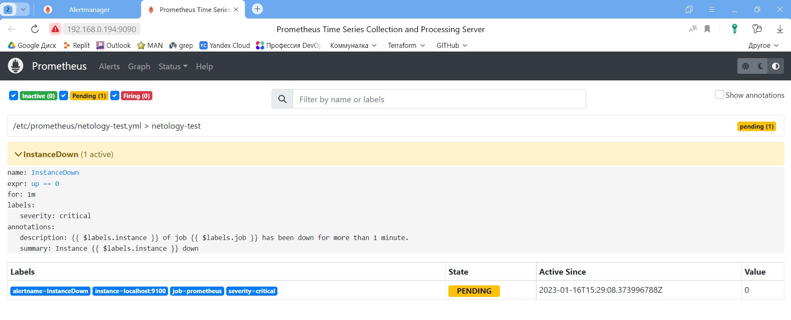
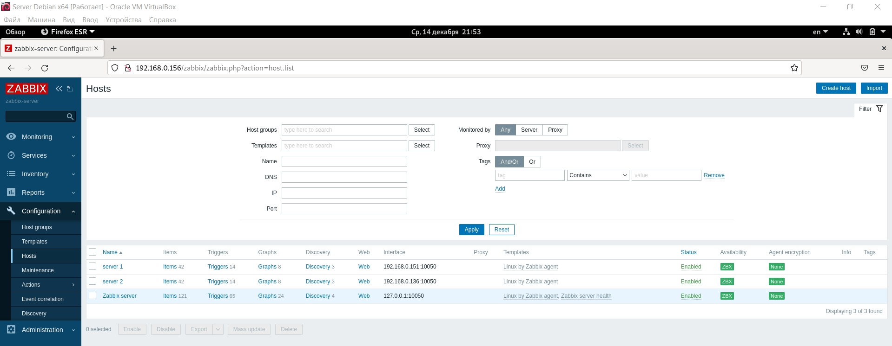
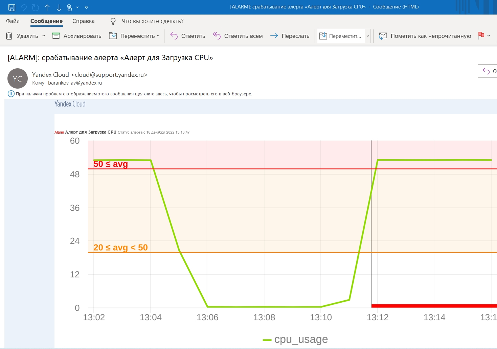
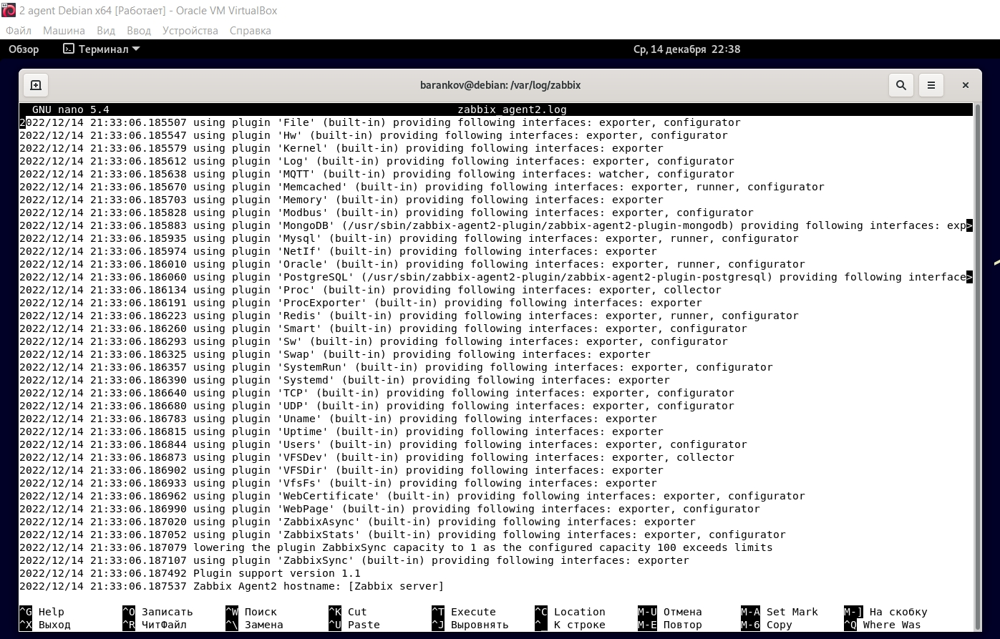
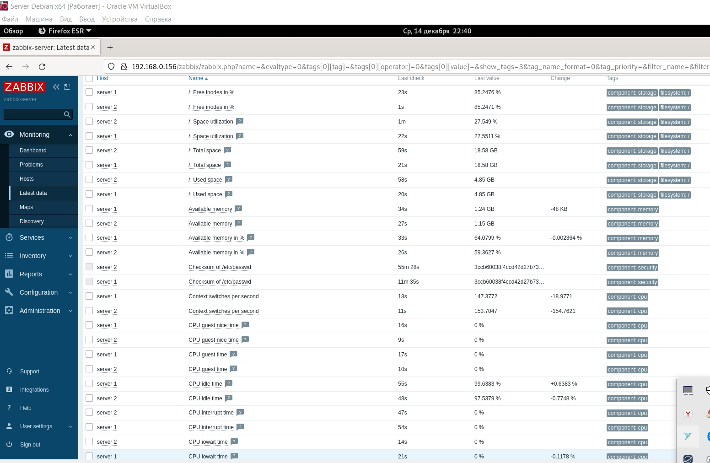
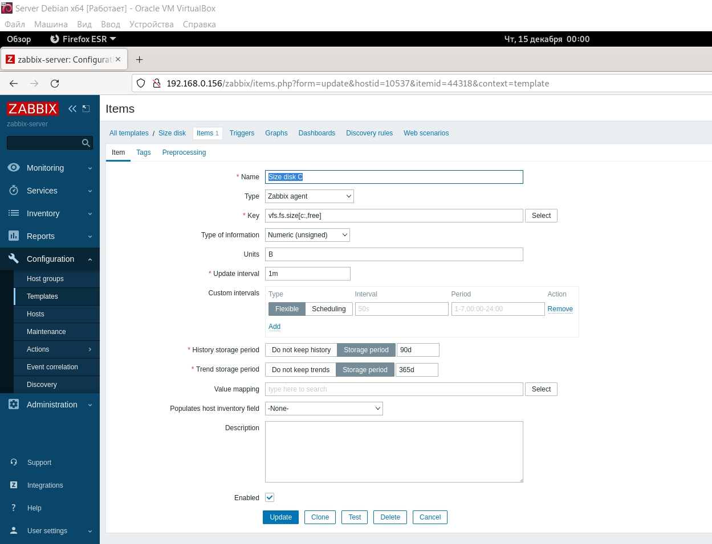
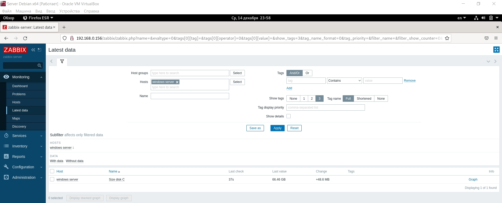
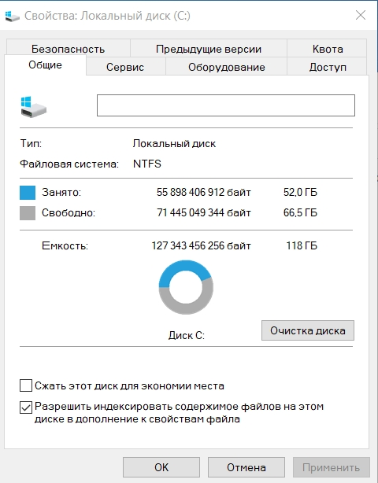

# Домашнее задание к занятию "`9.2. Zabbix. Часть 1`" - `Баранков Антон`

### Задание 1

Команды:
sudo apt install postgresql
wget https://repo.zabbix.com/zabbix/6.0/debian/pool/main/z/zabbix-release/zabbix-release_6.0-4%2Bdebian11_all.deb
dpkg -i zabbix-release_6.0-4+debian11_all.deb
sudo apt update
sudo apt install zabbix-server-pgsql zabbix-frontend-php php7.4-pgsql zabbix-apache-conf zabbix-sql-scripts nano -y # zabbix-agent
sudo -u postgres createuser --pwprompt zabbix
sudo -u postgres createdb -O zabbix zabbix
zcat /usr/share/zabbix-sql-scripts/postgresql/server.sql.gz | sudo -u zabbix psql zabbix
sudo nano /etc/zabbix/zabbix_server.conf
sudo systemctl restart zabbix-server apache2 # zabbix-agent
sudo systemctl enable zabbix-server apache2 # zabbix-agent

### Задание 2

Команды:
wget https://repo.zabbix.com/zabbix/6.0/debian/pool/main/z/zabbix-release/zabbix-release_6.0-4%2Bdebian11_all.deb
dpkg -i zabbix-release_6.0-4+debian11_all.deb
apt update
sudo apt install zabbix-agent -y
sudo systemctl restart zabbix-agent
sudo systemctl enable zabbix-agent

### Задание 3

