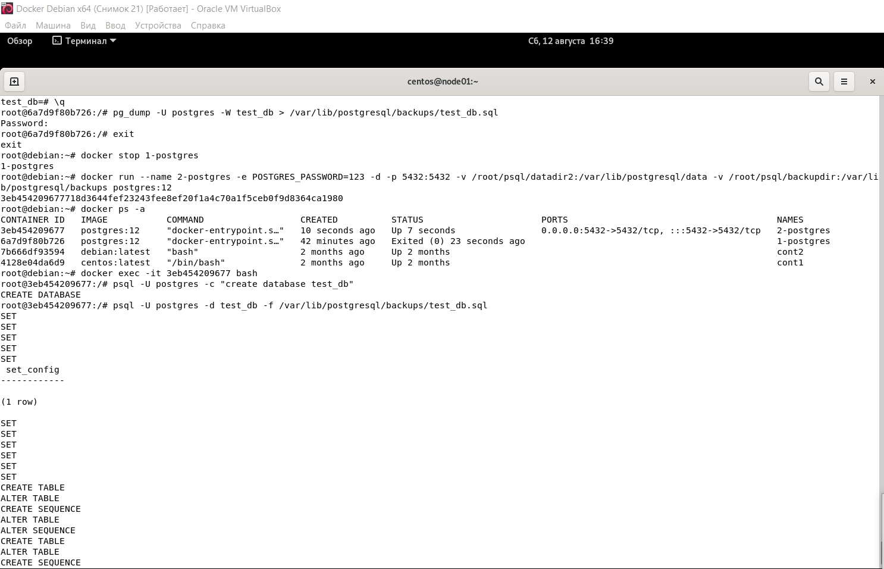
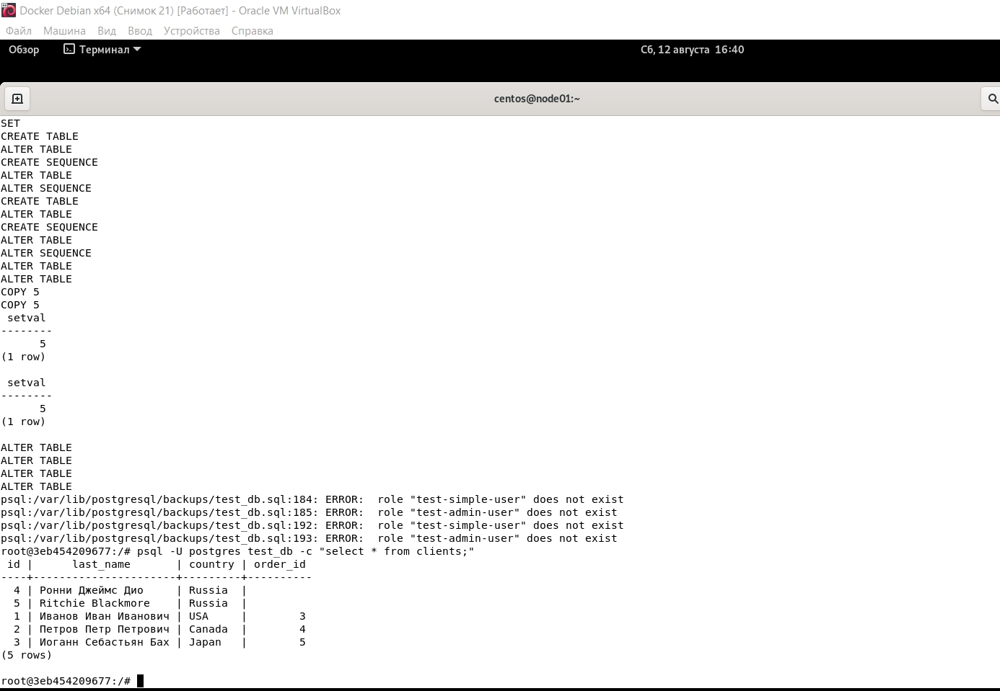

# Домашнее задание к занятию "2. «SQL»" - Баранков Антон"

### Задание 1
docker run --name 1-postgres -e POSTGRES_PASSWORD=123 -d -p 5432:5432 -v /root/psql/datadir:/var/lib/postgresql/data -v /root/psql/backupdir:/var/lib/postgresql/backups postgres:12  

### Задание 2

### Задание 3

### Задание 4

### Задание 5

0.00 - ориентировочная стоимость запуска. Это время, затрачиваемое до начала фазы вывода, например, время на сортировку в узле сортировки.  
13.00 - ориентировочная общая стоимость. Это делается исходя из предположения, что узел плана выполняется до завершения, т. е. извлекаются все доступные строки.  
298 - предполагаемое количество строк, выводимых этим узлом плана.  
244 - расчетная средняя ширина строк, выводимых этим узлом плана (в байтах).  
Затраты измеряются в произвольных единицах, определяемых параметрами затрат планировщика. Традиционная практика состоит в том, чтобы измерять затраты в единицах дисковых сборщиков страниц.  

### Задание 6

