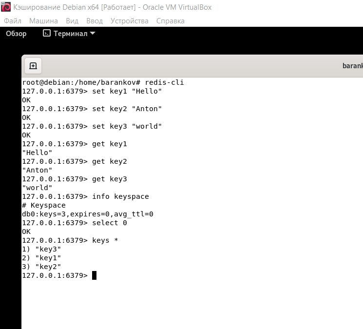

# Домашнее задание к занятию "5. «Оркестрация кластером Docker контейнеров на примере Docker Swarm»" - Баранков Антон"

### Задание 1
1. В режиме replication сервисы запускаются на нескольких узлах кластера и могут иметь несколько реплик. В режиме global сервисы запускаются на каждом узле кластера.  
2. В Docker Swarm используется алгоритм Raft для выбора лидера. Raft - это алгоритм консенсуса, который обеспечивает свойства, присущие распределенным системам: согласование значений в системе с отказоустойчивостью. Алгоритм также обеспечивает взаимное исключение через процесс выбора лидера; управление членством в кластере; глобально.  
3. Overlay Network - это сеть Docker, которая использует драйвер сети overlay. Overlay-сеть - это виртуальная сеть, которая связывает несколько физических хостов, на которых запущен Docker. Она используется для связи между контейнерами в кластере (Docker Swarm).  

### Задание 2

## Вариант первый

## Вариант второй

### Задание 3

## Вариант первый

## Вариант второй

### Задание 4

Команда docker swarm update --autolock=true используется для блокировки менеджера Swarm после его перезапуска и выдает ключ для разблокировки. Разблокировать менеджер SWARM можно командой docker swarm unlock с использованием ключа.
