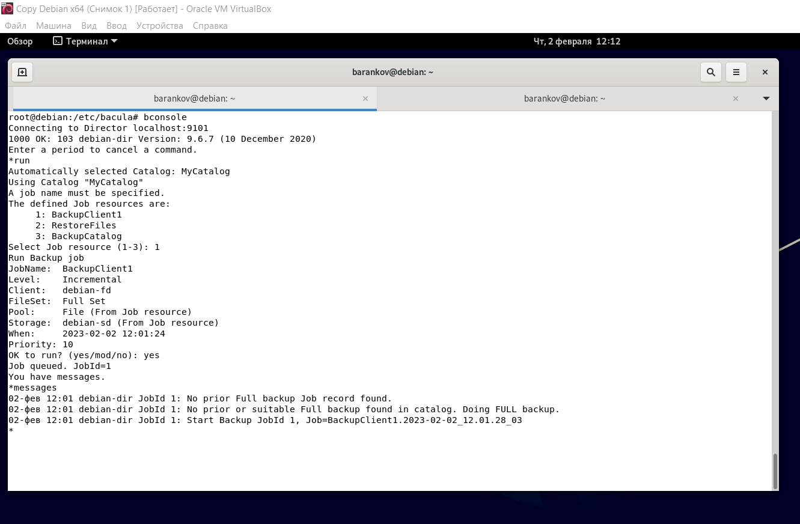
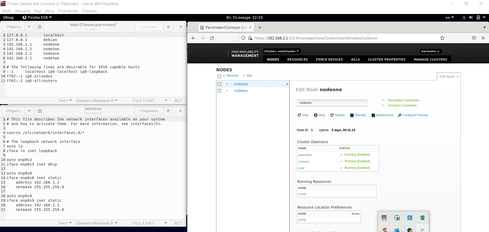
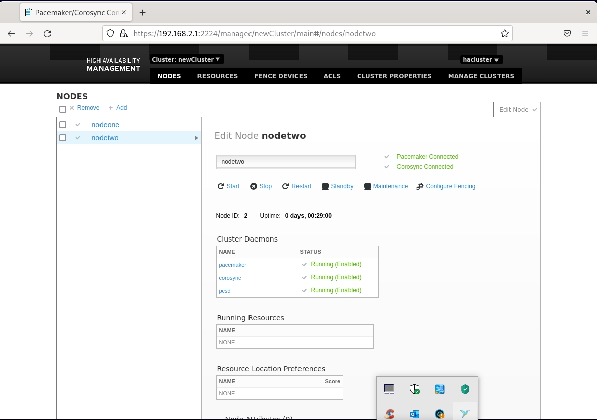

# Домашнее задание к занятию "`10.4 «Резервное копирование»`" - `Баранков Антон`

### Задание 1
В чём разница между:
- полным резервным копированием,
- дифференциальным резервным копированием,
- инкрементным резервным копированием.

При полном копировании всегда делается полная копия всего, поэтому является самым долгим процессом, при этом сильно нагружает сеть и диски.  
При дифференциальном резервном копировании сначала делается полная копия всего, затем при каждом запуске процесса резервируются только измененные данные, но точкой отсчета является состояние времени полного бэкапа, при этом процесс резервирования быстрее, чем у полного копирования.  
При инкрементном резервном копировании сначала делается полное копирования, затем резервируются данные, которые были изменены с последнего слепка, т.е. отправной точкой следующего слепка является предыдущий слепок, а не слепок полного копирования, как при дифференциальном резервном копировании. Поэтому данный вид копирования самый быстрый.  

### Задание 2

[bacula-dir.conf](img/bacula-dir.conf)  
[bacula-fd.conf](img/bacula-fd.conf)  
[bacula-sd.conf](img/bacula-sd.conf)  

### Задание 3

**Файл rsyncd.conf**  

pid file = /var/run/rsyncd.pid  
log file = /var/log/rsyncd.log  
transfer logging = true  
munge symlinks = yes  

[data]  
path = /var  
uid = root  
read only = yes  
list = yes  
comment = Data backup Dir  
use chroot = false  
auth users = backup  
secrets file = /etc/rsyncd.scrt  

**Файл скрипта**  
 
#!/bin/bash  
date  
syst_dir=/backup/  
srv_name=server1  
srv_ip=192.168.0.144  
srv_user=backup  
srv_dir=data  
echo "Start backup ${srv_name}"  
mkdir -p ${syst_dir}${srv_name}/increment/  
/usr/bin/rsync -avz --progress --delete --password-file=/etc/rsyncd.scrt ${srv_user}@${srv_ip}::${srv_dir} ${syst_dir}${srv_name}/current/ --backup --backup-dir=${syst_dir}${srv_name}/increment/`date +%Y-%m-%d`/  
/usr/bin/find ${syst_dir}${srv_name}/increment/ -maxdepth 1 -type d -mtime +30 -exec rm -rf {} \;  
date  
echo "Finish backup ${srv_name}"  

