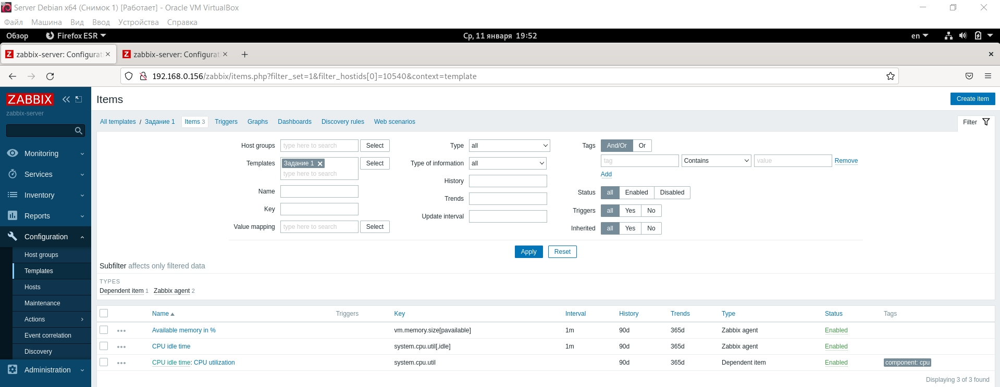
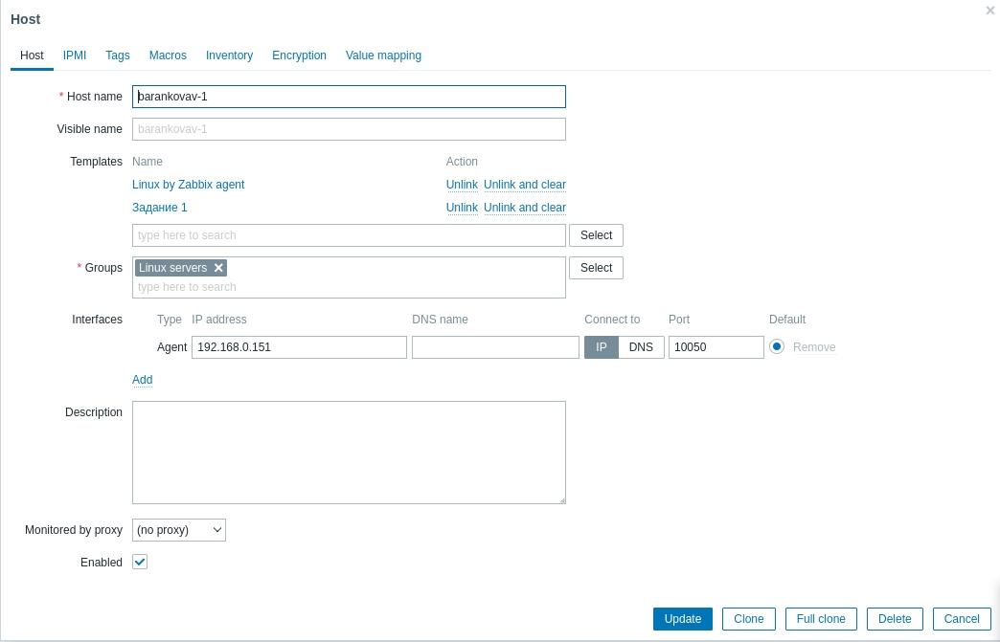
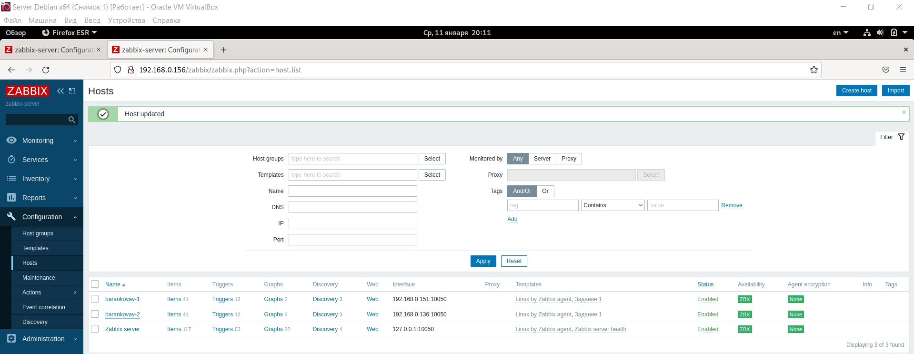
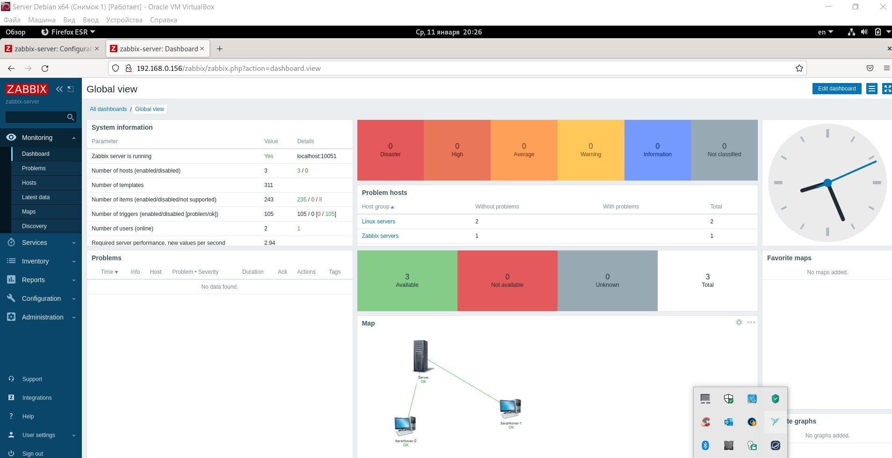
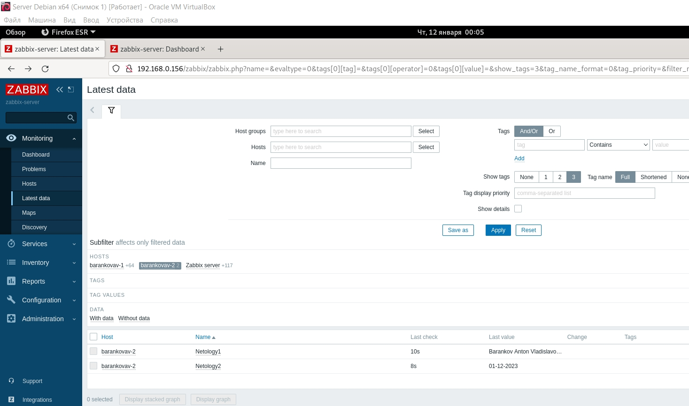
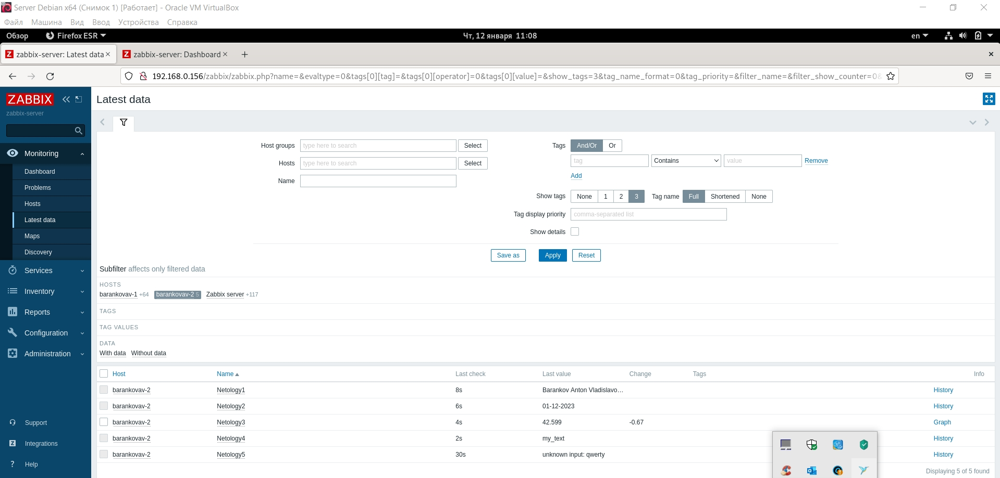
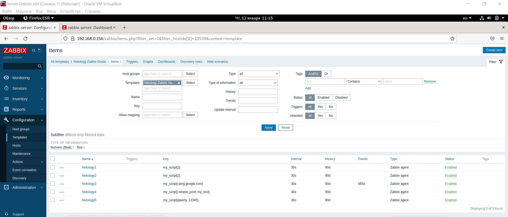
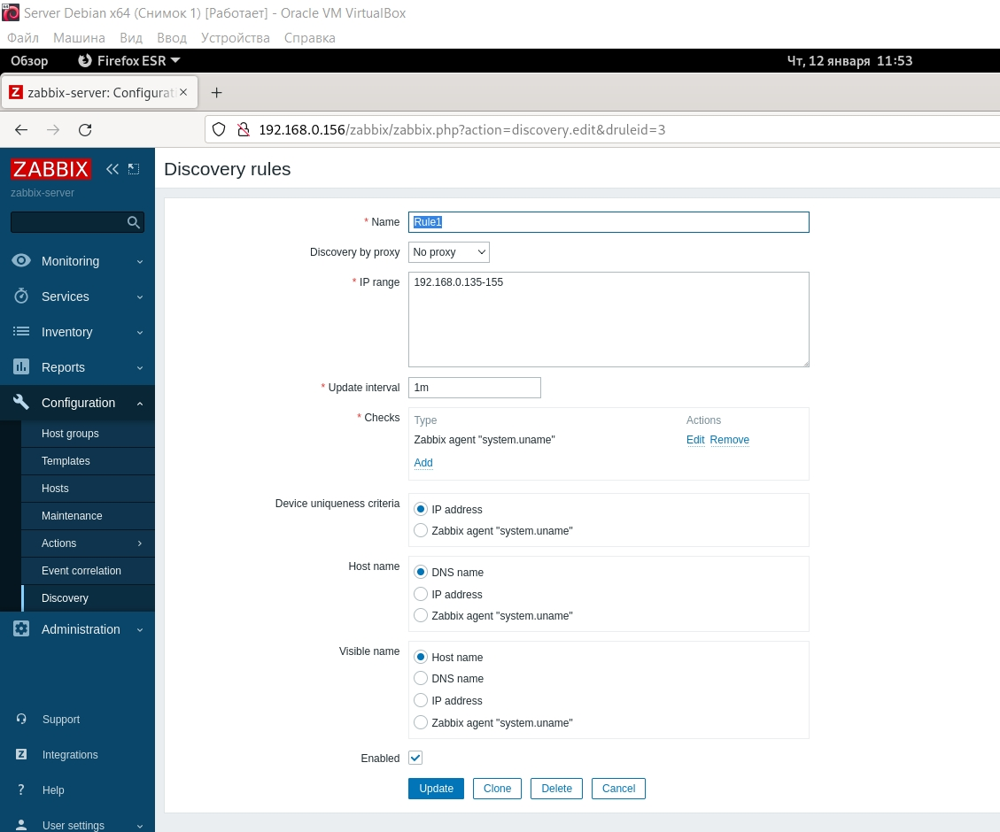
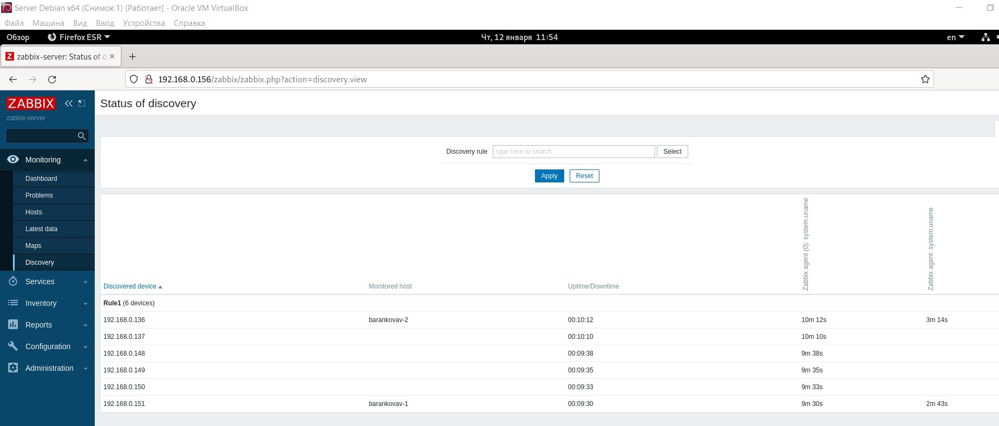

# Домашнее задание к занятию "`9.3 «Система мониторинга Zabbix. Часть 2»`" - `Баранков Антон`

### Задание 1

### Задания 2-3

### Задание 4

### Задание 5

### Задание 6

#### Скрипт

#!/bin/bash\    
if [ "$1" = 1 ]; then  
echo "Barankov Anton Vladislavovich"  
fi  
if [ "$1" = 2 ]; then  
date "+%m-%d-%Y"  
fi  

### Задание 7

Неверно прочитал задание вначале и подумал, что надо взять предыдущий скрипт на bash и добавить в него те же операции, что и в Python-скрипте из лекции (прилагаю) 

#### Bash-скрипт

#!/bin/bash\  
if [ "$1" = 1 ]; then  
echo "Barankov Anton Vladislavovich"  
elif [ "$1" = 2 ]; then  
date "+%m-%d-%Y"  
elif [ "$1" = '-ping' ]; then  
ping -c 1 "$2" | tail -1| awk '{print $4}' | cut -d '/' -f 2  
elif [ "$1" = '-simple_print' ]; then  
echo $2  
else  
echo unknown input: $1  
fi  

Затем после выполнения задания перечитал его еще раз и понял, что надо было просто дополнить Python-скрипт (поэтому тоже прилагаю)

### Python-скрипт

import sys  
import os  
import re  
import datetime  
if (sys.argv[1] == '-ping'):  
    result=os.popen("ping -c 1 " + sys.argv[2]).read()  
    result=re.findall(r"time=(.*) ms", result)  
    print(result[0])  
elif (sys.argv[1] == '-simple_print'):  
    print(sys.argv[2])  
elif (sys.argv[1] == '1'):  
    print('Barankov Anton Vladislavovich')  
elif (sys.argv[1] == '2'):  
    print(datetime.date.today())  
else:  
    print(f"unknown input: {sys.argv[1]}")  

### Задание 8

### Задание 9
Не понял, что значит "разработанные вами ранее параметры пользователей" + недостаточность времени, поэтому решил сдавать без 9 задания.
