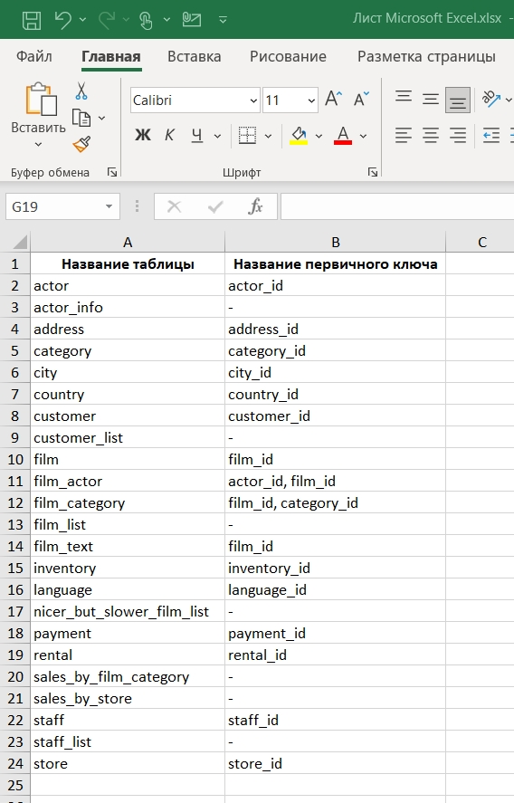
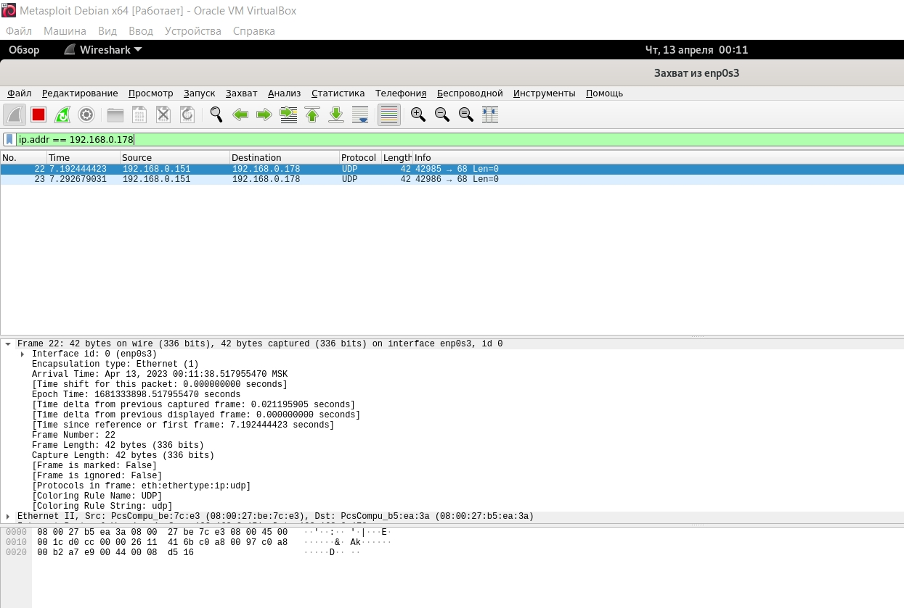
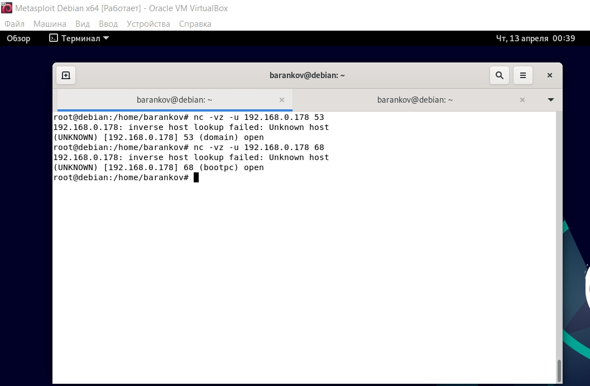

# Домашнее задание к занятию "13.1. «Уязвимости и атаки на информационные системы» - Баранков Антон"

### Задание 1
Уязвимости:  
1. vsftpd 2.3.4 ftp-anon: Anonymous FTP login allowed (FTP code 230)  
Разрешен анонимный доступ  
2. 25/tcp   open  smtp        Postfix smtpd  
|_smtp-commands: metasploitable.localdomain, PIPELINING, SIZE 10240000, VRFY, ETRN, STARTTLS, ENHANCEDSTATUSCODES, 8BITMIME, DSN,  
|_ssl-date: 2023-04-12T11:04:55+00:00; 0s from scanner time.  
| sslv2:  
|   SSLv2 supported  
Используются устаревшие шифры.  
3. 53/tcp   open  domain      ISC BIND 9.4.2  
Устаревшая версия DNS-сервера. Уязвимо для удаленного отравления кэша DNS и переполнения буфера.  

### Задание 2
SYN: использует флаги SYN для проверки портов TCP.  
Согласно примеру по 21 порту хост отправил только SYN на целевой хост. Целевой хост возвратил SYN-ACK, затем хост отправил RST для разрыва соединения. Значит порт открыт.  
Если бы порт был закрыт, то целевой хост вернул бы RST.Если бы не было ответа после нескольких повторных передач, либо была ошибка недоступности ICMP, то порт был бы помечен как отфильтрованный.  

FIN: использует флаги FIN для проверки портов TCP.  
Согласно примеру по 21 порту хост отправил FIN на целевой хост. Ответ от целевого хоста отсутствовал, значит порт открыт или фильтруется.  
Если бы порт был закрыт, то целевой хост вернул бы RST. Если бы была получена ошибка недоступности ICMP, то значит порт фильтруется.  

Xmas: использует флаги FIN, URG и PSH для проверки портов TCP.  
Согласно примеру по 21 порту хост отправил FIN, URG и PSH. Ответ от целевого хоста отсутствовал, значит порт открыт или фильтруется.  
Если бы порт был закрыт, то целевой хост вернул бы RST. Если бы была получена ошибка недоступности ICMP, то значит порт фильтруется.  

UDP: использует флаги UDP для проверки портов UDP.  
Согласно примеру по 53 порту хост отправил UDP-запрос на целевой хост. Целевой хост ответил, что ICMP недоступен, значит порт открыт.  

Согласно примеру по 68 порту хост отправил UDP-запрос на целевой хост. Целевой хост ничего не ответил, значит порт открыт или фильтруется.  

Но если использовать утилиту netcat, то можно увидеть, что 68 порт открыт.  

