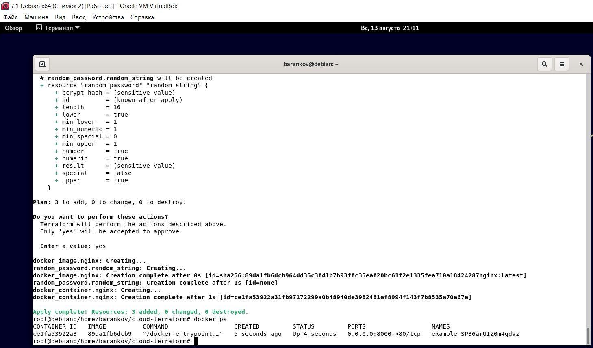
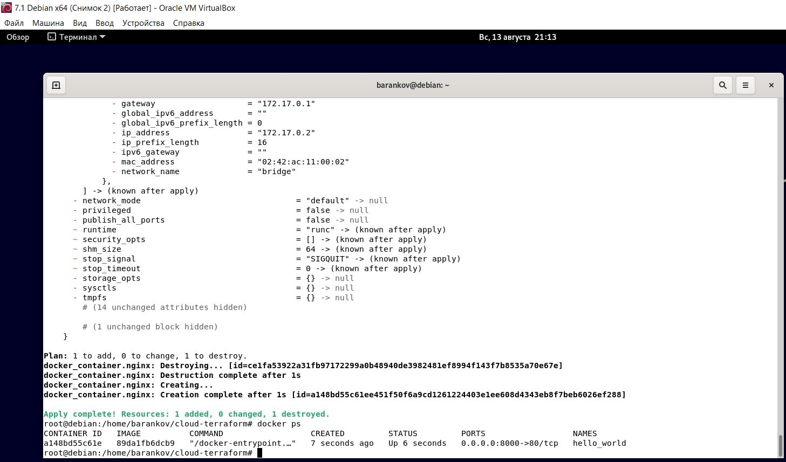

# Домашнее задание к занятию "1. «Введение в Terraform»" - Баранков Антон"

Скачайте и установите актуальную версию Terraform >=1.4.X . Приложите скриншот вывода команды terraform --version.  


### Задание 1
1. Перейдите в каталог src. Скачайте все необходимые зависимости, использованные в проекте.  
2. Изучите файл .gitignore. В каком terraform-файле, согласно этому .gitignore, допустимо сохранить личную, секретную информацию?  

Секретная информация должна быть сохранена в следующих директориях:  
- personal.auto.tfvars — это файл, который содержит приватные переменные, используемые в Terraform.  
- *.tfstate — это файл, который хранит текущее состояние инфраструктуры.  

3. Выполните код проекта. Найдите в state-файле секретное содержимое созданного ресурса random_password, пришлите в качестве ответа конкретный ключ и его значение.  

"result": "N4QUzd6fFJUnEdRw"  

4. Раскомментируйте блок кода, примерно расположенный на строчках 29–42 файла main.tf. Выполните команду terraform validate. Объясните, в чём заключаются намеренно допущенные ошибки. Исправьте их.  

Error: Missing name for resource  
Для ресурса docker_image не хватало имени.  

Error: Invalid resource name  
Для ресурса docker_container имя начиналось с цифры.  

Также была указана несуществующая переменная random_password.random_string_FAKE и в слове resulT большая буква T.  

Верный код:

```go
resource "docker_image" "nginx" {
  name         = "nginx:latest"
  keep_locally = true
}

resource "docker_container" "nginx" {
  image = docker_image.nginx.image_id
  name  = "example_${random_password.random_string.result}"

  ports {
    internal = 80
    external = 8000
  }
}
```

5. Выполните код. В качестве ответа приложите вывод команды docker ps.  



6. Замените имя docker-контейнера в блоке кода на hello_world. Не перепутайте имя контейнера и имя образа. Мы всё ещё продолжаем использовать name = "nginx:latest". Выполните команду terraform apply -auto-approve. Объясните своими словами, в чём может быть опасность применения ключа -auto-approve. В качестве ответа дополнительно приложите вывод команды docker ps.  

Применение ключа -auto-approve в Terraform позволяет автоматически перезапустить службу контейнера при изменении конфигурации или при нехватке ресурсов. Это может быть полезно, если вы хотите запустить контейнер с определенным именем, но затем изменить его без остановки сервиса. Однако, следует учитывать, что применение ключа -auto-approve может привести к неожиданным последствиям, таким как перезапуск контейнера при обновлении Docker, что может привести к потере данных или повреждению системы.  



7. Уничтожьте созданные ресурсы с помощью terraform. Убедитесь, что все ресурсы удалены. Приложите содержимое файла terraform.tfstate.  

```go
{
  "version": 4,
  "terraform_version": "1.5.5",
  "serial": 55,
  "lineage": "4cbc4fa2-2138-5682-89bd-697db1a5642b",
  "outputs": {},
  "resources": [],
  "check_results": null
}
```

8. Объясните, почему при этом не был удалён docker-образ nginx:latest. Ответ подкрепите выдержкой из документации провайдера docker.  

keep_locally (Логическое значение) Если true, то изображение Docker не будет удалено при операции уничтожения. Если это значение равно false, изображение будет удалено из локального хранилища docker при операции уничтожения.
