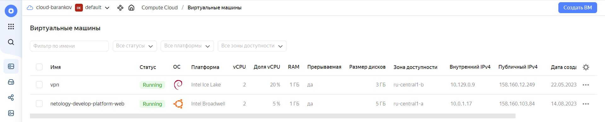
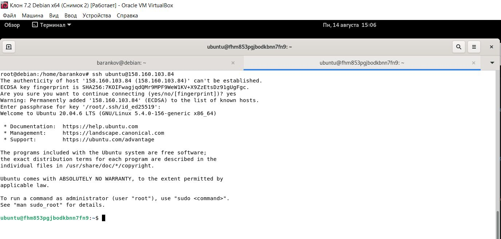
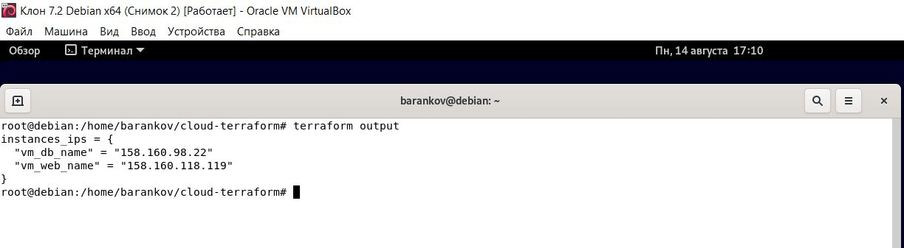

# Домашнее задание к занятию "2. «Основы Terraform. Yandex Cloud»" - Баранков Антон"

### Задание 1
1. Изучите проект. В файле variables.tf объявлены переменные для Yandex provider.  
2. Переименуйте файл personal.auto.tfvars_example в personal.auto.tfvars. Заполните переменные: идентификаторы облака, токен доступа. Благодаря .gitignore этот файл не попадёт в публичный репозиторий. Вы можете выбрать иной способ безопасно передать секретные данные в terraform.  
3. Сгенерируйте или используйте свой текущий ssh-ключ. Запишите его открытую часть в переменную vms_ssh_root_key.  
4. Инициализируйте проект, выполните код. Исправьте намеренно допущенные синтаксические ошибки. Ищите внимательно, посимвольно. Ответьте, в чём заключается их суть.  

```go
resource "yandex_compute_instance" "platform" {
  name        = "netology-develop-platform-web"
  platform_id = "standard-v1" #ошибка в слове standart, а также v4 не поддерживается Яндекс.Cloud)
  resources {
    cores         = 2 #только 2 или 4 ядра
    memory        = 1
    core_fraction = 5
  }
  boot_disk {
    initialize_params {
      image_id = data.yandex_compute_image.ubuntu.image_id
    }
  }
  scheduling_policy {
    preemptible = true
  }
  network_interface {
    subnet_id = yandex_vpc_subnet.develop.id
    nat       = true
  }

  metadata = {
    serial-port-enable = 1
    ssh-keys           = "ubuntu:${file(var.vms_ssh_root_key)}"
  }

}
```

5. Ответьте, как в процессе обучения могут пригодиться параметры preemptible = true и core_fraction=5 в параметрах ВМ. Ответ в документации Yandex Cloud.  

Параметр preemptible означает, что мы создаем прерываемую виртуальную машину, которая может быть автоматически остановлена и удалена в любой момент, если ресурсы платформы будут необходимы для других задач. Преимущество такой виртуальной машины в том, что она стоит дешевле, чем обычная. Это может пригодиться в процессе обучения, если мы хотим экономить на расходах и готовы к возможным перезапускам нашей ВМ.  

Параметр core_fraction означает, что мы указываем гарантированную долю vCPU для нашей виртуальной машины. Это позволяет нам использовать часть процессорного времени, а не целое ядро. Например, если мы укажем core_fraction=5 , то наша ВМ будет иметь доступ к 5% vCPU. Это также может пригодиться в процессе обучения, если мы хотим оптимизировать использование ресурсов и не нуждаемся в высокой производительности.  


В качестве решения приложите:  

скриншот ЛК Yandex Cloud с созданной ВМ;  



скриншот успешного подключения к консоли ВМ через ssh. К OS ubuntu необходимо подключаться под пользователем ubuntu: "ssh ubuntu@vm_ip_address";  



### Задание 2
1. Изучите файлы проекта.  
2. Замените все хардкод-значения для ресурсов yandex_compute_image и yandex_compute_instance на отдельные переменные. К названиям переменных ВМ добавьте в начало префикс vm_web_ . Пример: vm_web_name.  
3. Объявите нужные переменные в файле variables.tf, обязательно указывайте тип переменной. Заполните их default прежними значениями из main.tf.  
4. Проверьте terraform plan. Изменений быть не должно.  

[Main.tf](./2/Main.tf)  
[Variables.tf](./2/Variables.tf)  

### Задание 3
1. Создайте в корне проекта файл 'vms_platform.tf' . Перенесите в него все переменные первой ВМ.  
2. Скопируйте блок ресурса и создайте с его помощью вторую ВМ в файле main.tf: "netology-develop-platform-db" , cores = 2, memory = 2, core_fraction = 20. Объявите её переменные с префиксом vm_db_ в том же файле ('vms_platform.tf').  
3. Примените изменения.  

### Задание 4
1. Объявите в файле outputs.tf output типа map, содержащий { instance_name = external_ip } для каждой из ВМ.  
2. Примените изменения.  
3. В качестве решения приложите вывод значений ip-адресов команды terraform output.  



Прилагаю файлы для ответа на задания 3 и 4.  

[Main.tf](./4/Main.tf)  
[Variables.tf](./4/Variables.tf)  
[Vms_platform.tf](./4/Vms_platform.tf)  
[Outputs.tf](./4/Outputs.tf)  

### Задание 5
1. В файле locals.tf опишите в одном local-блоке имя каждой ВМ, используйте интерполяцию ${..} с несколькими переменными по примеру из лекции.  
2. Замените переменные с именами ВМ из файла variables.tf на созданные вами local-переменные.  
3. Примените изменения.  

[Main.tf](./5/Main.tf)  
[Variables.tf](./5/Variables.tf)  
[Locals.tf](./5/Locals.tf)  
[Terraform.tfvars](./5/Terraform.tfvars)  

### Задание 6
1. Вместо использования трёх переменных ".._cores",".._memory",".._core_fraction" в блоке resources {...}, объедините их в переменные типа map с именами "vm_web_resources" и "vm_db_resources". В качестве продвинутой практики попробуйте создать одну map-переменную vms_resources и уже внутри неё конфиги обеих ВМ — вложенный map.  
2. Также поступите с блоком metadata {serial-port-enable, ssh-keys}, эта переменная должна быть общая для всех ваших ВМ.  
3. Найдите и удалите все более не используемые переменные проекта.  

[Main.tf](./6/Main.tf)  
[Variables.tf](./6/Variables.tf)  
[Terraform.tfvars](./6/Terraform.tfvars)  


